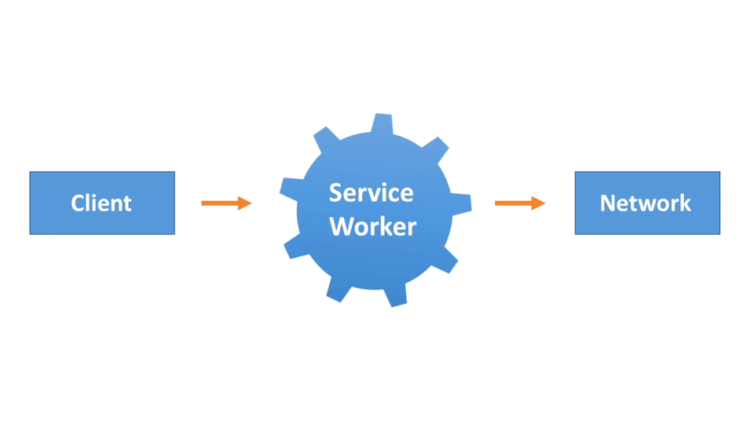
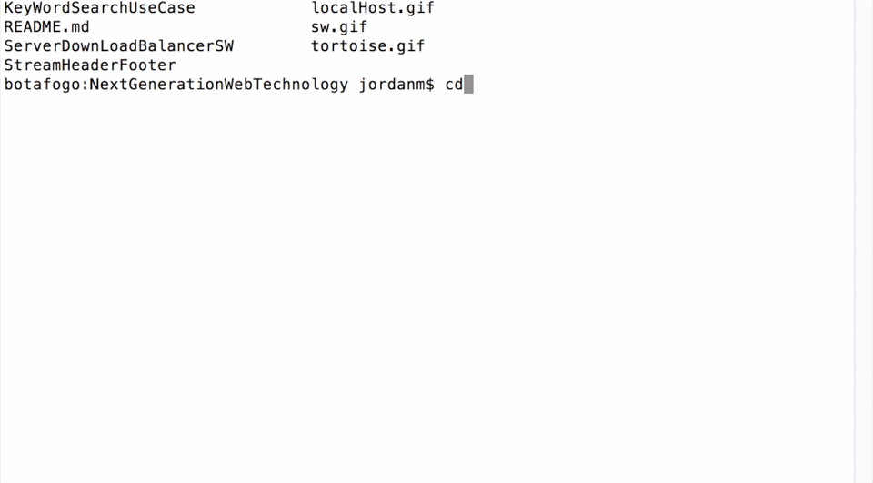
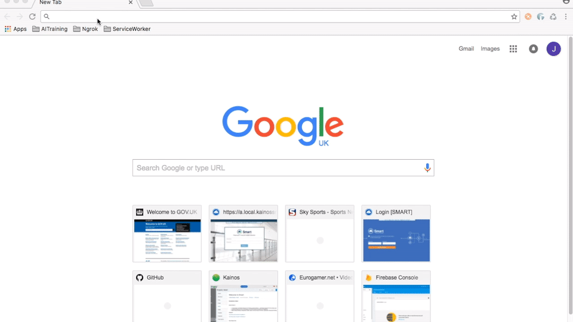
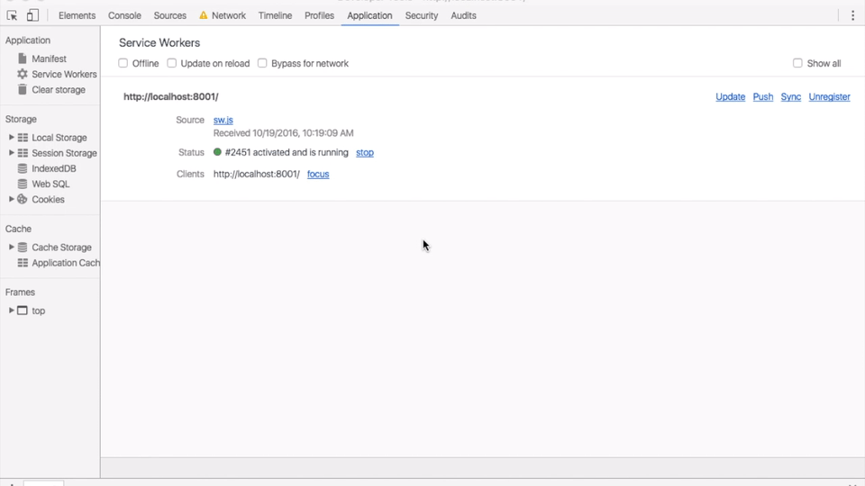
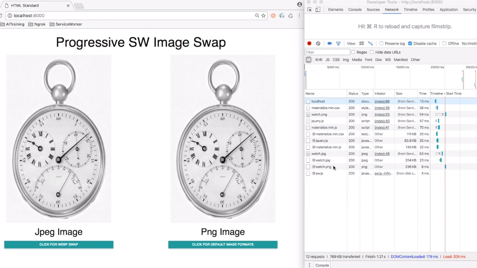
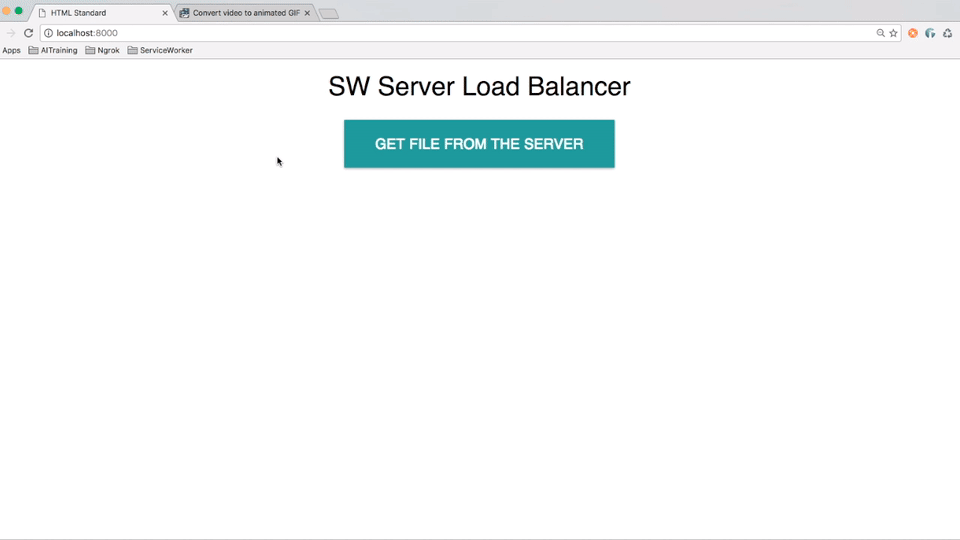
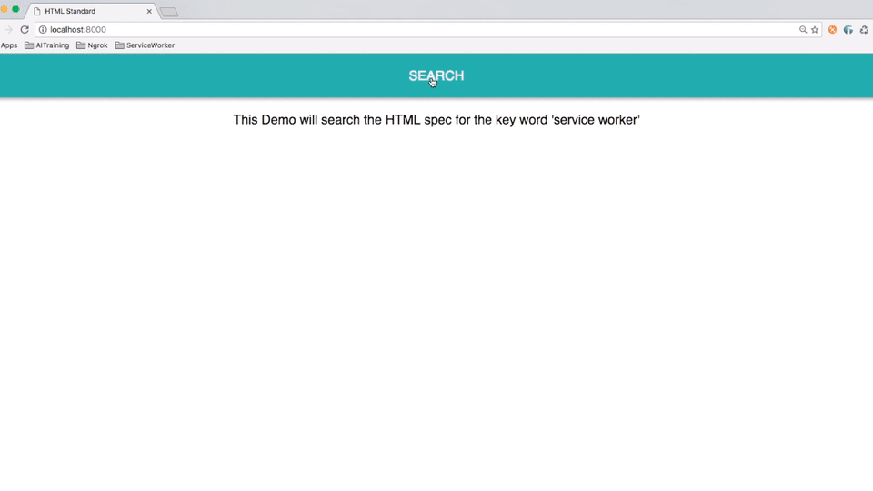
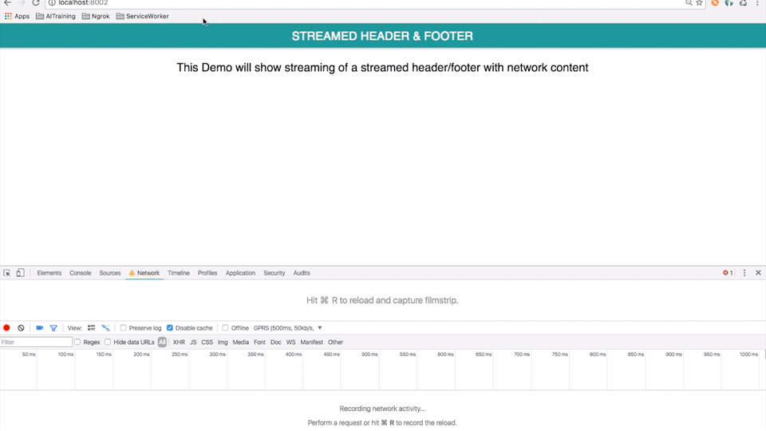
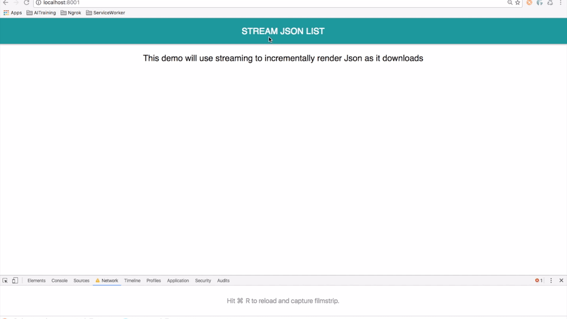

# Next Generation Web Technologies #

---

A key role of the Applied Innovation team at Kainos is the investigation of cutting edge technologies, with the goal of evaluating the business value for current or future projects. In the past the team have utilised modern browser based functionality with a focus on creating offline web experiences that can compete with native applications like those found on iOS or Android operating systems. This line of research has proven very successful and the underlying technologies are the basis of the research presented in this repository with a new perspective that targets performance and the user experience. To showcase this a series of use cases have been devised which highlight the advantages of applying modern web techniques to real world problems on the web, more on these later.

# #

So what are these mysterious technologies? 

# #

**Service Worker:** This is a script which runs in the background of a web page (Essentially acting as a proxy between the browser and the network) and has to ability to enable offline experiences, intercept network requests and other interesting tidbits that are examined in this repository. For more information check out this (much more detailed) article from Google [HERE](https://developers.google.com/web/fundamentals/getting-started/primers/service-workers) however if you don't have time for a deep dive into the topic (tut tut) this simple diagram should suffice.

# #



# #

**Web Streams:** When you think of streaming the first thing that comes to mind might be services such as Youtube which play video content as the data downloads. Conceptually this is essentially the same idea and browsers have supported streaming out of the box since the stone age of the internet. I am sure you have experienced rage inducing tortoise like internet speeds like this before:

##


##

This is essentially streaming, however it is only recently (2016!) that the API has been exposed to developers and allows us to do a bunch of cool things which will be examined later.


# Setup #

---

### Prerequesities ###

You will need a local web server which will be used to deploy the example use cases:

** Mac: ** [Simple Python Server](http://www.andyjamesdavies.com/blog/javascript/simple-http-server-on-mac-os-x-in-seconds)

** Windows: ** [Apache Tomcat](http://tomcat.apache.org)


### How To Run ###
Each use case is encapsulated within its own folder, see below for the list of scenarios that are available to run.

* ImageReverseProxy
* ServerDownLoadBalancerSW
* KeyWordSearchUseCase
* StreamHeaderFooter
* StreamJsonListRender

An example process of running a use case on a Mac using the suggested web server is show below.

# #



# #

Now you can go to a compatible browser (See FAQ section) and run the use case on the local host port you specified.

# #



# #


### Note ###
When a service worker first visits a page it will need to install before it can take control of the website, don't worry it will be ready to go for all subsequent visits.

you might be thinking, how do I install a service worker anyway? Don't worry I have you covered, just insert this small script into your html page and you are ready to go!


```
#!js
if ("serviceWorker" in navigator) {  
         navigator.serviceWorker.register("/sw.js").then(function(registration) {
         console.log("Service Worker registered");
}).catch(function(err) {
         console.log("Trouble loading the Service Worker: ", err);
});
}
```

### Note ###
While running each of these demos locally, the service worker will bind itself to the url (which includes the localhost port) so if you want to run each demo correctly you will have to either:

* Run each demo on a different port number
* Unregister the old service worker when you are finished with it (which allows installation of a new service worker) - a gif has been included showing the process of unregistering a service worker (in chrome developer tools)

## ##



## ##


# Use cases #
---

** ImageReverseProxy **


The purpose of this scenario is to highlight how a service worker can be utilised to manage the serving of images to the user from a performance standpoint. This showcases the ability of the service worker to act as a proxy which is decoupled from the web page and network, so far we have devised two sub tasks.

* 1) Detect if the browser supports a more efficient compression algorithm such as [WebP](https://developers.google.com/speed/webp/docs/compression) and manipulates the URL to request this format versus the standard Jpeg and PNG images that dominant the web. In supported browsers this will lead to an improved performance in terms of page load and in content driven websites this could be valuable. 

***Note - *** To test this functionality throttle the network connection using dev tools and toggle between the two options presented paying close attention to the load time for each state.

* 2) Detects the resolution of the client device and serve an image quality that is most appropriate for user. This boils down to either showing a high/low resolution image depending if the client device is within a certain threshold. Again this is a performance focused layer of functionality, since high resolution images are only served if appropriate which will benefit older devices in particular which have satisfactory fidelity if the images are lower resolution. 

***Note - *** To test this functionality manually change the screen resolution so that the height is below the 800px threshold.

## ##



## ##

** ServerDownLoadBalancerSW **

This demonstration showcases the service workers ability to not only intercept requests, but persist requests independent of the state of the webpage or server which hosts the network resources. 


***Note - ***You can simulate this behaviour by loading the local web page, turning off the local server and then selecting the button (which in the background tries to fetch a text file) which should activate the polling mechanism. To simulate the theoritical server coming back online, restart the local web server which the service worker should detect and then will make the original persisted request (hooray for service worker!).

## ##



## ##

** KeyWordSearchUseCase **

One of the key benefits of streaming is the ability to download a resource in chunks, each chunk can the be processed as it arrives versus downloading the entire resource first. Consider a scenario where the goal is to determine if a keyword is present within a (10 megabyte) text file hosted on the server, if that keyword is found early (say 1mb downloaded) then the stream which is handling the download can close. This has huge performance implications by saving the user time (not waiting for the whole file) and memory to store the file, in addition to this as each chunk search is complete it can be be stored or discarded.

*** Note - ***This example is setup to search the HTML spec for the keyword 'service worker', as it searches the html is rendered to the screen until the keyword is discovered. In addition to this if you open the dev tools console you can see output showing the accumulation of bytes being downloaded as the search continues.

## ##



## ##

** StreamHeaderFooter **

Typically on content driven websites there will be elements of the page that are consistently displayed through the users stay on the site, these are normally encapsulated in a header and footer. When the html is rendered from the server that means the header/footer is downloaded fresh each time, this does not make sense in terms of performance due to the impact on load time. However using streams we can cache the header and footer and then each time the user navigates to a new page form a unified stream of the header -> network body content -> and the footer. This will yield and almost instant first render and reduce the overall load time of each webpage on the site, over the course of a users visit this could prove valuable especially on slower connections.


*** Note - ***This example should be hosted on port '8001' as the location of the cached assets need to be specified explicitly within the service worker. Alternatively you can edit the service worker code directly to utilise a port number of your own choosing, in the example code below it is as simple as modifying the url string.

## ##

```
#!js
//Get Header/Footer from cache and html from network
const startFetch = caches.match('http://localhost:8002/html/header.html');
const contentFetch = fetch("html/content.html").catch(() => new Response("Failed"));      
const endFetch = caches.match('http://localhost:8002/html/footer.html');
```

## ##

*** Note - *** To see the main benefit of the example you should throttle the connection speed using browser developer tools which will showcase the instant first render due to the cached header. In the example below I am using a GPRS connection from within Google Chrome developer tools.

## ##



## ##

** StreamJsonListRender **
In web applications a typical use case involves the rendering of lists of data to the user, this typically involves downloading the entire file holding the data (XML/JSON etc) and then using Javascript to handle the HTML manipulation. However using streams we can download, process and render the data as the service worker receives it using streams. This involves adjusting the structure of the JSON from the server so that each element can be parsed independently, see the example below:

## ##

```
#!json

{"id":1,"first_name":"Judy","last_name":"Fowler","email":"jfowler0@histats.com"}
{"id":2,"first_name":"Ralph","last_name":"Wright","email":"rwright1@examiner.com"}
{"id":3,"first_name":"Thomas","last_name":"Simpson","email":"tsimpson2@paginegialle.it"}
{"id":4,"first_name":"Bruce","last_name":"Cox","email":"bcox3@wikispaces.com"}
{"id":5,"first_name":"Carol","last_name":"Simmons","email":"csimmons4@trellian.com"}
```

## ##

***Note - ***You should know the drill by now, when you run the demo a splash page should appear (to allow the service worker to install) and clicking on the button should showcase the list streaming. To fully appreciate the impact of streaming a throttled connection should be used from with the browser developer tools. You will see the browser rendering the JSON as it receives it, the power of this functionality will be most evident when larger JSON files are being downloaded, this is a blocker streaming lets us bypass!

## ##



## ##

# FAQ #
---
**Q:** What browsers are supported?

**A:** For scenario ImageReverseProxy & ServerDownLoadBalancerSW check out [THIS](http://caniuse.com/#search=service%20worker) website for information on the latest service worker support.

**B:** For scenarios KeyWordSearchUseCase, StreamHeaderFooter & StreamJsonListRender (which all use streaming + service worker)

* Chrome - 52
* Opera - 39
* Firefox - X
* Safari - X
* Edge/IE - X

# Examples Built With #
---
* Materialize 
* JavaScript (JQuery)
* HTML
* CSS

# The Future #
---
Publication of a blog investigating each of the five use cases presented here, with detailed performance metrics and exploration into the various benefits associated with scenario.

# Contact Information #
---
* appliedinnovation@kainos.com

* J.McDonald@kainos.com