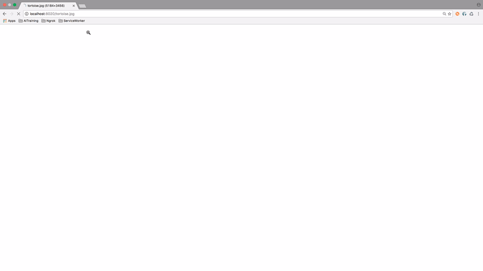

# Next Generation Web Technologies #

---

A key role of the Applied Innovation team at Kainos is the investigation of cutting edge technologies, with the goal of evaluating the business value for current or future projects. In the past the team have utilised modern browser based functionality with a focus on creating offline web experiences that can compete with native applications like those found on iOS or Android operating systems. This line of research has proven very successful and the underlying technologies are the basis of the research presented in this repository with a new perspective that targets performance and the user experience. To showcase this a series of use cases have been devised which highlight the advantages of applying modern web techniques to real world problems on the web, more on these later.

So what are these mysterious technologies? 

**Service Worker:** This is a script which runs in the background of a web page (Essentially acting as a proxy between the browser and the network) and has to ability to enable offline experiences, intercept network requests and other interesting tidbits that are examined in this repository. For more information check out this (much more detailed) article from Google [HERE](https://developers.google.com/web/fundamentals/getting-started/primers/service-workers) however if you don't have time for a deep dive into the topic (tut tut) this simple diagram should suffice.

**Web Streams:** When you think of streaming the first thing that comes to mind might be services such as Youtube which play video content as the data downloads. Conceptually this is essentially the same idea and browsers have supported streaming out of the box since the stone age of the internet. I am sure you have experienced rage inducing tortoise like internet speeds like this before:

This is essentially streaming, however it is only recently (2016!) that the API has been exposed to developers and allows us to do a bunch of cool things which will be examined later.

# Setup #

---

### Prerequesities ###

You will need a local web server which will be used to deploy the example use cases:

** Mac: ** [How To](http://www.andyjamesdavies.com/blog/javascript/simple-http-server-on-mac-os-x-in-seconds)

** Windows: ** [Apache Tomcat](http://tomcat.apache.org)

### How To Run ###
Each use case is encapsulated within its own folder, see below for the list of scenarios that are available to run.

* ImageReverseProxy
* ServerDownLoadBalancerSW
* KeyWordSearchUseCase
* StreamHeaderFooter
* StreamJsonListRender

An example process of running a use case on a Mac using the suggested web server is show below.

### Use cases ###

- intro
- go through each in turn

### FAQ ###
Q: What browsers are supported?

A: TODO

### Examples Built With ###
* Materialize 
* JQuery
* JavaScript
* HTML
* CSS

### Contact Information ###